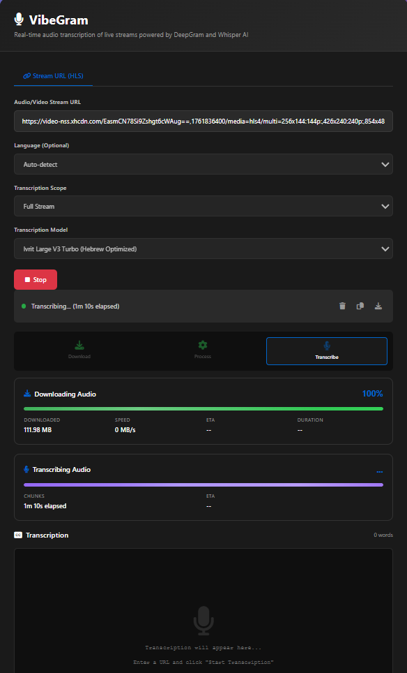

# 🎙️ VibeGram - Live Audio Stream Transcription (Modular Architecture v3.0)

A real-time audio transcription application with a **newly refactored modular architecture** that streams audio from URLs (m3u8, video links, audio files) and transcribes them live using multiple transcription engines: **Deepgram Nova-3** (cloud), **Ivrit** (Hebrew-optimized), or **OpenAI Whisper** (local). Inspired by [Vibe](https://github.com/thewh1teagle/vibe).



## 🚨 Major Update: Modular Architecture (v3.0)

The application has been completely refactored from a monolithic 3,618-line single file to a clean modular architecture with **17 specialized modules**. The main `app.py` is now just **42 lines** (98.8% reduction!) while maintaining 100% backward compatibility.

### Key Improvements:
- **Maintainability**: Each module has a single responsibility
- **Testability**: Individual modules can be unit tested
- **Scalability**: New features can be added without touching core logic
- **Zero Breaking Changes**: All APIs and functionality preserved exactly

## ✨ Features

### Core Transcription
- **Live Streaming Transcription**: Transcribe audio as it streams, no need to download the entire file first
- **Multiple Transcription Engines**:
  - **Deepgram Nova-3**: Ultra-fast cloud-based transcription with <100ms latency
  - **Ivrit Large V3 Turbo**: Hebrew language optimized local model
  - **OpenAI Whisper**: Local transcription with multiple model sizes (tiny, base, small, medium, large)
  - **Faster-Whisper**: Optimized Whisper implementation with 2-4x speed improvement
- **Speaker Diarization**: Identify and label multiple speakers in audio
- **YouTube & Video Platform Support**: Download and transcribe from YouTube, Vimeo, Facebook, Twitter, TikTok, and more using yt-dlp
- **Multiple Format Support**: Works with m3u8 (HLS), direct video URLs, audio files, and streaming media
- **Audio Caching**: Intelligent caching system reduces CPU usage by 60% for repeated content
- **VOD Detection**: Automatically detects Video-on-Demand vs live streams and optimizes transcription path

### User Experience
- **Real-time Progress Tracking**:
  - Download progress with %, MB, speed, and ETA
  - Transcription progress with chunk processing indicators
  - Multi-stage visual indicator (Download → Process → Transcribe)
  - Incremental transcription output for long audio files
- **Real-time Display**: See transcription results live as they're processed
- **Language Support**: Auto-detect or manually specify from 50+ languages
- **Easy Export**: Copy to clipboard or download as text file
- **Model Selection**: Choose your transcription model from the UI
- **Beautiful Web UI**: Modern, responsive interface with real-time updates and dark theme
- **Enhanced Error Messages**: Detailed error reporting with helpful troubleshooting suggestions

### Performance & DevOps
- **Modular Architecture**: Clean separation of concerns with 17 specialized modules
- **Thread-Safe Model Loading**: Double-check locking pattern for concurrent access
- **Async Processing**: Fully async architecture with asyncio for non-blocking operations
- **Parallel Transcription**: Optional parallel chunk processing with ThreadPoolExecutor
- **Advanced Audio Processing**: FFmpeg integration with progress monitoring
- **Cache Management**: Built-in API endpoints to monitor and manage audio cache
- **Docker Ready**: Multi-stage builds with CUDA support for GPU acceleration
- **Health Monitoring**: Comprehensive health check and GPU diagnostics endpoints

## 🚀 Quick Start with Docker

### Prerequisites

- Docker and Docker Compose installed
- At least 2GB RAM (4GB+ recommended for better models)
- Internet connection (for initial model download)

### 1. Clone or Download

```bash
git clone <your-repo-url>
cd webapp
```

### 2. Quick Start Script (Recommended)

```bash
# Make start script executable (if not already)
chmod +x start.sh

# Run quick start
./start.sh
```

### 2. Manual Build and Run

```bash
# Build and start the container
docker-compose up --build

# Or run in detached mode
docker-compose up -d --build
```

### 3. Access the Application

Open your browser and navigate to:
```
http://localhost:8009
```

## 📁 Project Structure (NEW Modular Architecture)

```
webapp/
├── app.py                      # Minimal FastAPI entry point (42 lines!)
├── api/
│   ├── routes.py              # REST API endpoints (health, cache, GPU info)
│   └── websocket.py           # WebSocket transcription endpoint
├── config/
│   ├── settings.py            # Environment variables configuration
│   ├── constants.py           # Application constants
│   └── availability.py        # Library availability detection
├── core/
│   ├── state.py               # Global state management
│   └── lifespan.py            # Application startup/shutdown handlers
├── models/
│   └── loader.py              # Thread-safe model loading with caching
├── services/
│   ├── audio_processor.py    # Audio download, streaming, and processing
│   ├── transcription.py      # All transcription services (1208 lines)
│   ├── diarization.py        # Speaker diarization service
│   └── video_metadata.py     # YouTube metadata extraction
├── utils/
│   ├── validators.py         # URL and input validation
│   ├── helpers.py           # Formatting and utility functions
│   ├── websocket_helpers.py # WebSocket state management
│   └── cache.py             # Cache management utilities
├── static/
│   ├── index.html           # Web UI interface
│   ├── css/
│   │   └── styles.css      # Extracted CSS styles (712 lines)
│   └── vibegram.png        # Logo
├── cache/                   # Runtime cache directory (gitignored)
├── capture/                 # Audio capture directory (gitignored)
├── download_cache/         # Download cache directory (gitignored)
├── requirements.txt        # Python dependencies
├── requirements.ivrit.txt  # Ivrit-specific dependencies
├── Dockerfile             # Standard Docker build
├── Dockerfile.ivrit       # Ivrit models Docker build
├── docker-compose.yml     # Docker orchestration
├── docker-compose.ivrit.yml # Ivrit Docker orchestration
└── .dockerignore          # Docker build exclusions
```

### Module Responsibilities

| Module | Lines | Purpose |
|--------|-------|---------|
| **app.py** | 42 | Minimal entry point, mounts routes and WebSocket |
| **api/routes.py** | 220 | REST API endpoints for health, cache, GPU info |
| **api/websocket.py** | 344 | Main WebSocket transcription workflow |
| **services/transcription.py** | 1208 | All transcription logic (Whisper, Deepgram, streaming) |
| **services/audio_processor.py** | 670 | Audio download, FFmpeg processing, streaming |
| **services/diarization.py** | 241 | Speaker identification and segmentation |
| **models/loader.py** | 180 | Thread-safe model loading with caching |
| **utils/cache.py** | 242 | Cache management for audio and downloads |

## 📚 Documentation

- **[Quick Start Guide](QUICKSTART.md)**: Fast setup guide for new users
- **[API Documentation](API.md)**: Complete WebSocket and REST API reference
- **[Project Summary](project_summary.md)**: Comprehensive project overview
- **[Docker Build Ready](DOCKER_BUILD_READY.md)**: Docker configuration details
- **[Progress Tracker](PROGRESS.md)**: Modular refactoring progress

## 🎯 How to Use

1. **Select Model**: Choose your transcription engine:
   - **Deepgram Nova-3**: Fastest, cloud-based, best for real-time (requires API key)
   - **Ivrit Large V3 Turbo**: Hebrew-optimized local model
   - **Whisper Models**: Local processing with various size/accuracy tradeoffs
2. **Enter URL**: Paste an m3u8, video, or audio URL into the input field
3. **Select Language** (Optional): Choose the audio language or leave as "Auto-detect"
4. **Enable Diarization** (Optional): Toggle to identify different speakers
5. **Click "Start Transcription"**: The application will begin streaming and transcribing
6. **Watch Live Results**: Transcription appears in real-time as audio is processed
7. **Export**: Use "Copy Text" or "Download" buttons to save your transcription

## ⚙️ Configuration

### Model Selection

Choose a transcription engine based on your needs:

| Model | Type | RAM | Speed | Accuracy | Best For |
|-------|------|-----|-------|----------|----------|
| **Deepgram Nova-3** | Cloud | N/A | **Fastest** (<100ms) | Excellent | Production, real-time |
| **Ivrit Large V3 Turbo** | Local | ~10GB | Medium | Best for Hebrew | Hebrew content |
| **whisper-v3-turbo** | Local | ~6GB | Fast | Very Good | General multilingual |
| tiny | Local | ~1GB | Very Fast | Basic | Testing, demos |
| base | Local | ~1GB | Fast | Good | General purpose |
| small | Local | ~2GB | Medium | Better | High accuracy |
| medium | Local | ~5GB | Slow | High | Critical apps |
| large | Local | ~10GB | Very Slow | Best | Maximum accuracy |

### Environment Variables

Configure in `.env` file:

```env
# Model Configuration
WHISPER_MODEL=whisper-v3-turbo
IVRIT_MODEL_NAME=ivrit-large-v3-turbo
MODEL_SIZE=base

# Deepgram Configuration
DEEPGRAM_API_KEY=your_api_key_here
DEEPGRAM_MODEL=nova-3
DEEPGRAM_LANGUAGE=en-US
DEEPGRAM_TIME_LIMIT=0  # 0 for unlimited

# Performance Settings
USE_PARALLEL_TRANSCRIPTION=false
PARALLEL_WORKERS=4
YTDLP_CHUNK_SECONDS=60
YTDLP_CHUNK_OVERLAP=5

# Cache Configuration
AUDIO_CACHE_ENABLED=true
CACHE_ENABLED=true
CACHE_MAX_AGE_HOURS=24

# Server Configuration
PORT=8009
```

## 🛠️ Development Setup (Without Docker)

### Prerequisites

- Python 3.11+
- FFmpeg installed and in PATH
- pip

### Installation

```bash
# Create virtual environment
python -m venv venv
source venv/bin/activate  # On Windows: venv\Scripts\activate

# Install dependencies
pip install -r requirements.txt

# Run the application
python app.py
```

Access at: `http://localhost:8009`

## 🔧 API Endpoints

### REST API

- `GET /` - Web UI interface
- `GET /health` - Health check with model status
- `POST /api/video-info` - Get YouTube video metadata
- `GET /gpu` - GPU diagnostics and CUDA information
- `GET /api/cache/stats` - Cache statistics
- `POST /api/cache/clear` - Clear cache
- `GET /api/download-cache/stats` - Download cache statistics
- `POST /api/download-cache/clear` - Clear download cache

### WebSocket API

- `ws://localhost:8009/ws/transcribe` - Main transcription endpoint

WebSocket Message Protocol:
```javascript
// Request
{
  "url": "https://example.com/video.mp4",
  "model": "whisper-v3-turbo",
  "language": "auto",
  "diarization": false,
  "captureMode": "full"
}

// Response Types
{
  "type": "status",           // Status update
  "type": "transcription",    // Transcription text
  "type": "transcription_chunk", // Incremental chunk
  "type": "transcription_progress", // Progress update
  "type": "complete",         // Completion signal
  "type": "error"            // Error message
}
```

## 🐛 Troubleshooting

### Model Loading Issues
- **Problem**: Model fails to load on startup
- **Solution**: Check available disk space and RAM. Models are cached after first download.

### WebSocket Connection Failed
- **Problem**: Cannot connect to transcription service
- **Solution**: Ensure port 8009 is available and not blocked by firewall

### High Memory Usage
- **Problem**: Container uses too much RAM
- **Solution**: Use smaller models (tiny, base) or enable chunk processing

### Deepgram Authentication
- **Problem**: Deepgram transcription fails
- **Solution**: Verify DEEPGRAM_API_KEY is set correctly in .env file

## 📊 Performance Optimization

### Thread-Safe Model Loading
The application uses double-check locking for thread-safe model caching:
```python
with model_lock:
    if model_name not in whisper_models:
        # Load model once
        whisper_models[model_name] = load_model(...)
```

### Async Processing
All I/O operations use async/await for non-blocking execution:
- Audio download with progress tracking
- FFmpeg subprocess management
- WebSocket communication
- Deepgram API calls

### Caching Strategy
- SHA256-based audio chunk caching
- Download result caching
- Model instance caching
- HTML template caching at startup

## 🚀 Recent Updates

### v3.0 - Modular Architecture (Current)
- ✅ **Complete Refactoring**: From 3,618 lines monolith to 42 lines entry point
- ✅ **17 Specialized Modules**: Clean separation of concerns
- ✅ **Zero Breaking Changes**: 100% backward compatibility
- ✅ **Thread-Safe Model Loading**: Double-check locking pattern
- ✅ **Speaker Diarization**: Identify multiple speakers with pyannote
- ✅ **Improved Error Handling**: Detailed error messages and recovery

### v2.0 - Enhanced Features
- ✅ Real-time progress tracking with ETA
- ✅ Incremental transcription output
- ✅ Parallel chunk processing option
- ✅ VOD vs live stream detection
- ✅ GPU diagnostics endpoint

### v1.0 - Initial Release
- ✅ Basic transcription with Whisper
- ✅ Deepgram integration
- ✅ YouTube download support
- ✅ Web UI interface

## 🤝 Contributing

Contributions are welcome! The modular architecture makes it easy to:
- Add new transcription models
- Implement new features
- Fix bugs in isolation
- Write comprehensive tests

Please read [CONTRIBUTING.md](CONTRIBUTING.md) for guidelines.

## 📝 License

This project is open source. Feel free to use and modify as needed.

## 🙏 Credits

- **OpenAI Whisper**: State-of-the-art speech recognition
- **Faster-Whisper**: Optimized Whisper implementation
- **Deepgram**: Cloud transcription API
- **FFmpeg**: Audio/video processing
- **FastAPI**: Modern Python web framework
- **Pyannote**: Speaker diarization
- **Vibe**: Original inspiration

---

**Built with ❤️ using Python, FastAPI, and modular architecture principles**